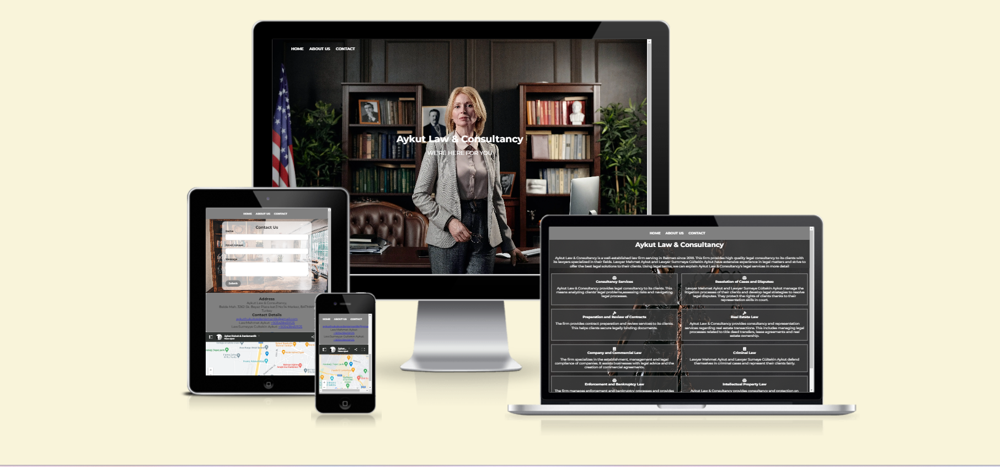
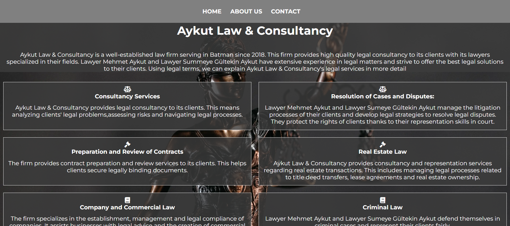
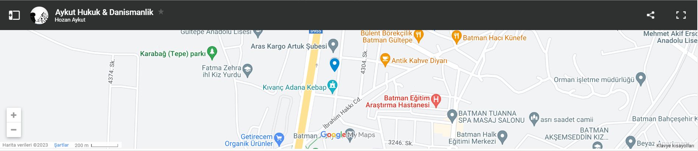
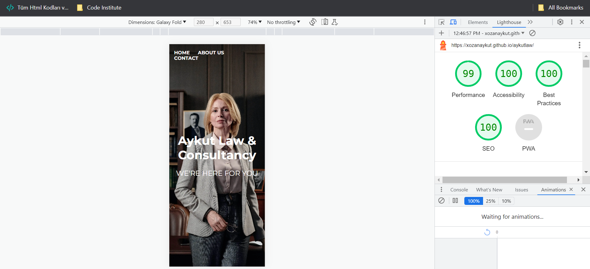
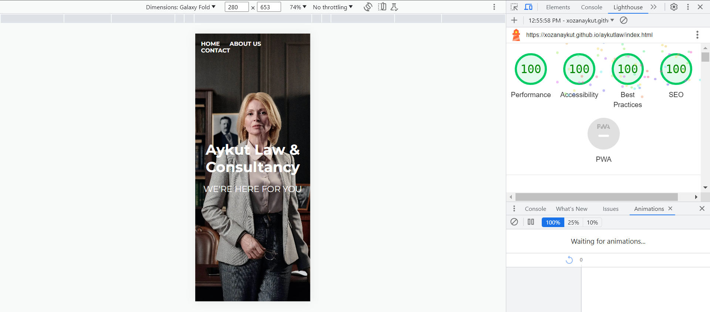
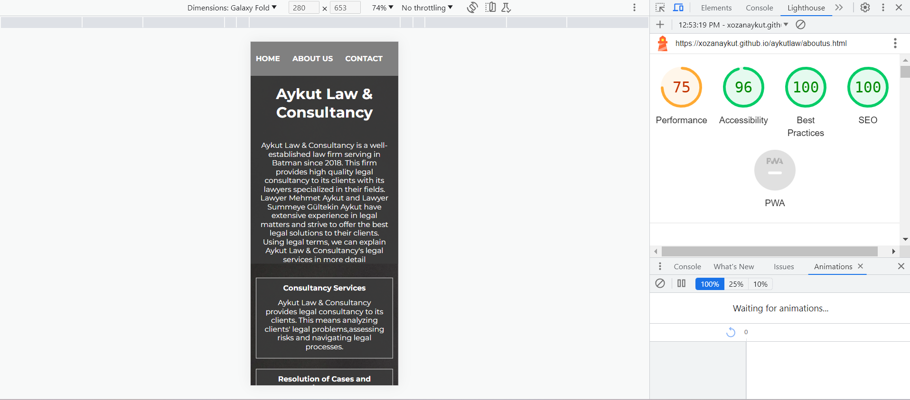
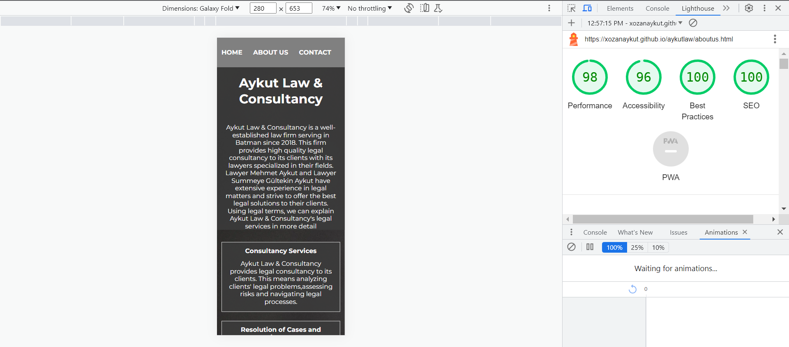
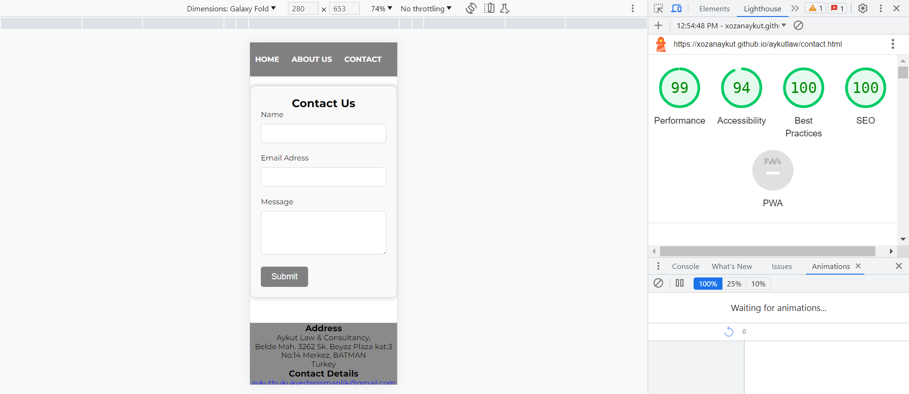
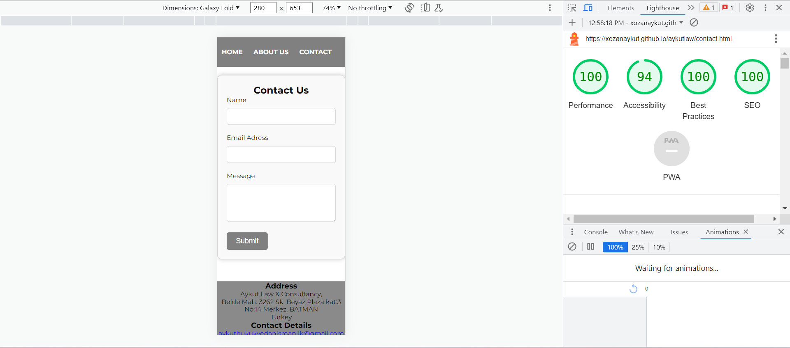

# Aykut Law & Consultancy

 [Aykut Law & Consultancy](https://xozanaykut.github.io/aykutlaw/)

Aykut Law & Consultancy, is designed as the website of a law and consultancy firm.
Aykut Law & Consultancy is a website that aims to provide comprehensive legal services for individuals and businesses with legal needs. This project aims to provide customers with information in the field of law, enable them to learn more about the firm and encourage them to contact the firm to solve their legal problems.
____

____

## Existing Features
 
## Navigation Bar
- Featured on all three pages, the full responsive navigation bar includes links to the Logo, Home page, About Us and Contact page and is identical in each page to allow for easy navigation.

- This section will allow the user to easily navigate from page to page across all devices without having to revert back to the previous page via the ‘back’ button.

____
## The Landing Page Image
- The home page starts with basic information about Aykut Law & Consultancy. It also includes images highlighting the firm's areas of expertise

## ABOUT US
- About Us describes in detail the legal services offered by the firm. Under each service, clients can find further information.

- Furthermore, clients can learn more about the members of the firm and there is an image highlighting their areas of expertise.

____
 ## The Footer
 - The footer section includes links to the relevant social media sites for Love Running. The links will open to a new tab to allow easy navigation for the user.
 
- The footer is valuable to the user as it encourages them to keep connected via social media.

____
## Contact
- The "Contact" section of the "Aykut Law & Consultancy" page is a section that allows users to get in touch with the business. The main purpose of this section is to provide a communication channel for users to ask questions, provide feedback or get in touch about any topic. Here is the content and importance of this section.

- Contact Form: The contact section usually includes a contact form. This form allows users to enter their name, email address, contact information and the message they want to convey. The form should have a user-friendly interface so that users can easily communicate their message.

____
## Address
- Phone Number: The contact section should also include the phone number of the business. Users may want to contact by phone in case of emergencies or for faster responses.

- Email Address: The email address of the business is important for users to communicate in writing. Users can use e-mail, especially when they want to communicate on lengthy or private matters.

- Physical Address (Optional): If the business operates from a physical location, the address of this location can be shared in the contact section. This can make it easier for local customers to visit the business.

____
## Map
- Map (Optional): If the business has a physical location, a map can be included in the contact section. This shows visitors the location of the business and can provide directions.

____
## Features Left to Implement
- To ingrate a calendar to book a call

- To add feedback from clients and case studies

- To apply for the internship program

____
## Validator Testing
- HTML: No errors were found when passing through the official [W3C validator](https://validator.w3.org/nu/?doc=https%3A%2F%2Fxozanaykut.github.io%2Faykutlaw%2F/)
 - CSS: No errors found when passing through the official [(Jigsaw) validator
Deployment](https://jigsaw.w3.org/css-validator/validator?uri=https%3A%2F%2Fxozanaykut.github.io%2Faykutlaw%2Fcontact.html&profile=css3svg&usermedium=all&warning=1&vextwarning=&lang=en)
____
## Deployment
- This section should describe the process you went through to deploy the project to a hosting platform (e.g. GitHub)

- The site was deployed to GitHub pages. The steps to deploy are as follows:

- In the GitHub repository, navigate to the Settings tab
- From the source section drop-down menu, select the Master Branch

- Once the master branch has been selected, the page will be automatically refreshed with a detailed ribbon display to indicate the successful deployment.
- The live link can be found here-

[https://xozanaykut.github.io/aykutlaw/index.html](https://xozanaykut.github.io/aykutlaw/index.html)
____
## Content
- Instructions on how to apply form verification on the Register page are taken from 
[Btkakademi](https://www.btkakademi.gov.tr)

- Icons in the footer taken from 
[ Font Awesome](https://fontawesome.com)
___
## media
- Image used on homepage and registration page taken from [Pexels](https://www.pexels.com/)

- The image used for the About Us page was taken from the website [Pexels](https://www.pexels.com/)
____
## performance
### Home page performance

____
### About Us page performance

____
### Contact page performance

